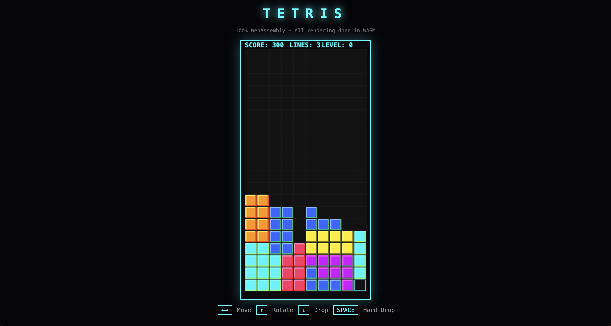

# WASM Tetris

**A fully playable Tetris game written in hand-written WebAssembly Text format (WAT).**

Built in 2 hours using LLM agents. No Rust. No C++. No compilation from higher-level languages. Just raw WebAssembly.



## The Point

This project demonstrates a thesis: **LLM agents are compilers**—perhaps the best compilers we've ever built.

I'm a staff engineer with 15 years of experience. I had never written WebAssembly before this project. The learning curve alone would normally take weeks—understanding the memory model, the instruction set, debugging with no error messages.

Instead, I described what I wanted, and it got compiled into working code.

Read the full article: [I Built a Website in Assembly in 2 Hours: Are LLM Agents the Ultimate Compiler?](YOUR_SUBSTACK_LINK)

## What's Inside

```
tetris.wat    → 900+ lines of hand-written WebAssembly Text format
tetris.wasm   → Compiled binary
game.js       → ~60 lines of minimal JavaScript bridge
index.html    → Simple HTML wrapper
```

### The WebAssembly does EVERYTHING:

- ✅ Game state management
- ✅ Piece physics & collision detection
- ✅ All 7 Tetromino types with rotation
- ✅ Line clearing & scoring
- ✅ Level progression
- ✅ **Full framebuffer rendering** (pixel-by-pixel)
- ✅ Color calculations & 3D cell effects
- ✅ Ghost piece preview

### JavaScript only provides the unavoidable browser bridges:

- Loading the WASM module (browser security requirement)
- Copying framebuffer to canvas (WASM can't access DOM)
- Forwarding keyboard events (WASM can't access browser events)

## Run It

```bash
# Clone and serve
git clone https://github.com/youssefhassan/tetris-wasm.git
cd tetris-wasm
python3 -m http.server 8080

# Open http://localhost:8080
```

## Controls

| Key | Action |
|-----|--------|
| ← → | Move |
| ↑ | Rotate |
| ↓ | Soft drop |
| Space | Hard drop |

## The Code

Here's what WebAssembly looks like. This is the collision detection function:

```wat
(func $check_collision (param $piece_type i32) (param $x i32) (param $y i32) (param $rotation i32) (result i32)
  (local $block i32)
  (local $block_x i32)
  (local $block_y i32)
  (local $grid_x i32)
  (local $grid_y i32)
  
  (local.set $block (i32.const 0))
  (block $break
    (loop $check_loop
      (local.set $block_x (call $get_piece_block_x (local.get $piece_type) (local.get $rotation) (local.get $block)))
      (local.set $block_y (call $get_piece_block_y (local.get $piece_type) (local.get $rotation) (local.get $block)))
      (local.set $grid_x (i32.add (local.get $x) (local.get $block_x)))
      (local.set $grid_y (i32.add (local.get $y) (local.get $block_y)))
      
      (if (i32.lt_s (local.get $grid_x) (i32.const 0)) (then (return (i32.const 1))))
      (if (i32.ge_s (local.get $grid_x) (global.get $GRID_WIDTH)) (then (return (i32.const 1))))
      (if (i32.ge_s (local.get $grid_y) (global.get $GRID_HEIGHT)) (then (return (i32.const 1))))
      
      ;; ... more checks
    )
  )
  (i32.const 0)
)
```

No arrays. No objects. Just memory offsets and stack operations.

## Memory Layout

```
Page 0 (0-65535): Game State
  0-199:      Grid cells (10x20 = 200 bytes)
  200-299:    Game variables (piece state, score, level, etc.)
  300-523:    Piece shape definitions (7 pieces × 4 rotations × 8 bytes)

Pages 1-4:    Framebuffer
  320×640 pixels × 4 bytes (RGBA) = 819,200 bytes
```

## The Thesis

Every abstraction layer in computing history faced skepticism:

- **"Real programmers don't use FORTRAN"** (1957)
- **"Garbage collection is for people who can't manage memory"** (1995)
- **"SQL optimizers can't be trusted"** (1980s)

Each time, the skeptics were wrong. Each abstraction made us more powerful.

LLM agents are the next layer. They collapse not just code translation, but the entire development workflow: documentation, learning, debugging, context-switching.

For the first time, **coding has consciousness above the 0 and 1.**

---

*Built with Claude. Written about on [Substack](https://open.substack.com/pub/youssefhassan13/p/i-built-tetris-in-webassembly-in?r=ecc3z&utm_campaign=post&utm_medium=web&showWelcomeOnShare=true).*
